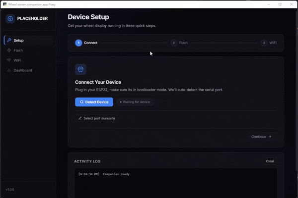
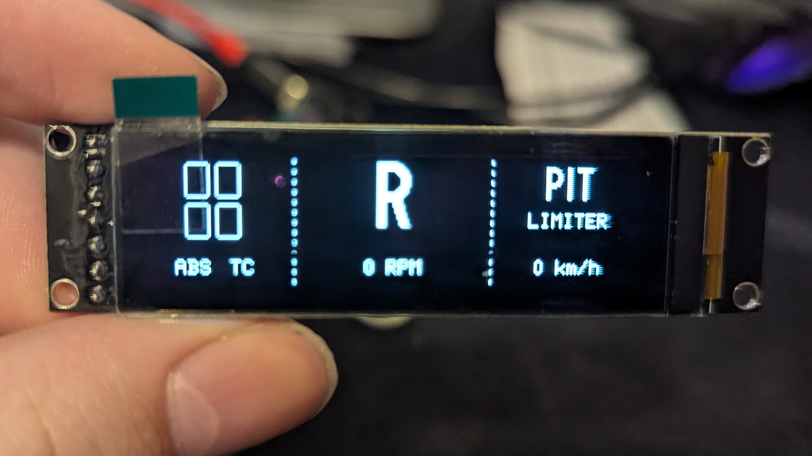

# Moza ES Lite Wheel Screen Mod – Devlog
## https://scraps.hackclub.com/projects/57
### I dont know why github refuses to format some text further down but I promise thats not on purpose

This project aims to add a 2.08-inch OLED screen to the **Moza ES Lite wheel** using a non intrusive, fully reversible mod.  
No permanent modifications to the wheel are required.

The goal is to display useful real-time telemetry from **Assetto Corsa** on the wheel itself, driven by an **ESP32** and a custom companion application.

Source code, firmware, and 3D-printable files will be released once a **stable version** is reached.

---

## Project Overview

- **Game:** Assetto Corsa, maybe other games in the future
- **Microcontroller:** XIAO ESP32-C6, C3, or S3
- **Display:** 2.08" OLED, 7 pin SPI
- **Host Platform:** PC
- **Companion App:** Python backend with embedded HTML/CSS/JS web UI
- **Communication:** Serial (Setup) + UDP (Telemetry)

---

## Initial Status

I began logging progress after the project was already started, with about ~5 hours of work completed before I started documenting the process.

**Current status as of 2/4/2026:**
(Before I started logging)

- Working companion script (no GUI, telemetry send only)
- Basic ESP32 functionality:
  - Boots successfully
  - Displays IP address while waiting for a companion app connection
- Basic screen functionality:
  - Displays core telemetry information

  
Hardware for today

    In this unlogged progress this is also where I determined the pinout of the ESP32 to the screen, this was the pinout of the example code I saw and I have not changed it since, if it works dont fix it. Some issues I remember running into was the screen wasnt showing data correctly, the fix for this was just that my cables were loose on the connectors, it was a simple fix and all I had to do was adjust it and the screen worked correctly!

---

## Devlog

## 2/5/2026
- Wrote initial documentation
- Planned changes and tasks for tomorrow.

---

## 2/6/2026

### Firmware (ESP32)
- Implemented serial Wi-Fi credential passing from companion app to ESP32 for simpler setup
- Added UDP heartbeat handling with a screen to show when the ESP32 is disconnected from the companion app

### Companion App (Backend)
- Rebuilt backend to serve web UI and API endpoints instead of being entirely terminal based
- Added firmware flashing support with esptool, again to simplify installation
- Added serial Wi-Fi credential passing (even though it was already listed this is a new change)
- Added heartbeat logic and handling
- Added automatic detection of ESP32

### Companion App (Frontend)
- Full UI design:
  - Dark theme
  - Sidebar navigation
  - Steps for onboarding for easy installation an setup
Notable features include:
  - Full onboarding setup
  - Data logging screen
  - Automatic detection of the correct COM port to use to flash firmware to the ESP32

  
Hardware for today

  Today I began looking how the internals of the Es Lite wheel works, when I first took apart the wheel I discovered the quick release, wheel body, and front face of the wheel are all 3 different parts.
  When I looking into the body of the wheel I found the connector to be a standard 4 pin 2.5mm pitch JST connector, which would make creating the PCB much easier.
  I noticed inside the wheel each pin of the connector is labled, clearly showing me which pin is which and also allowing me to know the wheel uses 12v internal power, which isnt great for me as esp32's run at 3.3v and I will have to add a buck converter.
  At this point I started to take the wheel apart further and noticed the connector on the wheel side is very difficult to remove and insert without tweasers so I definitely should add a easier way to remove the PCB after it is inserted.

---

## 2/7/2026 - 1:01am
  Dont really know why im up this late but ive decided to move the project up to a tier 4
  I believe because my project has become a full application and is no longer just a terminal app it qualifies for tier 4
  If any hackclub person thinks otherwise please contact me!

## 2/7/2026
  Todays I mostly focused on the ESP32 firmware side of things improve the gui and customization, see notes below

  
  
  ### Firmware (ESP32)
   - Improved GUI spacing, and functionality
   - Added functionality for in the future allow modular customizability of each major part of the screen
   - Added support for many more types of data to be sent to the screen
   - Many other minor bug fixes and gui changes

  ### Companion App (Backend)
   - Added outlines of a system for customization of the screen via the companion app
   - Added basic support for saving presets for customizations

  ### Companion App (Frontend)
   - No changes today

  ### PCB
  Today I started development of the PCB that will sit inside of the wheel providing power to the ESP32 and screen, below are some of the specs
   - Built in buck converter, converts the 12v given to the wheel to a safe 3.3v to power the wheel and screen, based on a AP63203WU-7 by Diodes
   - Easy ESP32 and screen connections, the ESP32 simply slides into place on the pcb while all you need to do is plug each pin of the screen into the labled header on the PCB
   - No modifications required to the wheel, the design ive made sits in the middle of the original cable connecting the quick connect base and the wheel, harmlessly sipping power from the base
   - Full open source, the PCB will be made open source once ive finished testing and building it, I may consider selling pre assembled PCB's but assume it will be fully diy until then

  
Hardware for today (yap warning)

    Today I started work on the pcb, to start I measure the size of the hole to fit something inside the wheel, which I found to be only 30mm in diameter, this is extremely small so I will need to optimize the pcb design for space and may need to use smaller components that will be difficult to hand solder.
    To start on the pcb I made the basic layout, a small circle with a extruding portion to connect the the internal wheel connector.
    Then I started finding components for the pcb, the hardest part about this is finding a way to safely convert the 12v internal wheel power to a safe 3.3v.
    The first thing I thought of is using a LDO but when I determined the worst case power consumption of the ESP32 and screen (assuming the ESP32 is actively transmitting wifi and the screen is completely on) to be about 500ma, which is way to high for a small LDO because it will have to dissipate a whopping **4.35 watts** of heat which is about **2-3 times** the amount of heat a AMS1117 LDO can dissipate on its own, as you may be able to tell this is definitely not the greatest for the survivability of my board, which leaves me no choice but to use a switching regulator.
    Switching regulators are much more efficient then LDO's but require more supporting components to function which means my issue of space on the board becomes a much bigger issue.
    This means I must find a small switching buck converter that requires minimal supporting components and can output 500ma at 3.3v, down from 12v
    These are quite strict requirements but after searching I eventually landed on the DIODES AP63203WU-7, requiring only 5 supporting components and coming in at a small TSOT-23-6 package size it is the perfect choice for my project. Additionally it having a input range of 3.8v to 32v gives lots of headroom on the input side, and a fixed output of 3.3v at a maximum of 2A gives lots of headroom for current draw, and means one less component is needed because it works at a fixed output and does not need a selected voltage.
    With the buck converter selected I can now begin work on the schematic of the pcb, the schematic is quite simple with the most complex part being the buck converter, but double checking everything is very important to ensure there will be no failures on the finished board.
    With the schematic done I could now begin work on the PCB, first I made the outline of the pcb and before anything 3d printed a accurate sized prototype of it to ensure it would actually fit inside the wheel, with the sizing confirmed I began creating the layout for components on the pcb, the most important being the connectors for the original plugs for the wheel.
    With all the components placed I could begin work on routing traces, I began wiring the new plug to the plug on the bottom of the pcb to plug into the inside pcb of the wheel, when I was routing the data traces of the connector I made sure to length match the traces to ensure there will be no compatibility issues, I doubt it made much of a difference considering how small the pcb is but its better to be safe than sorry. After this I routed the traces from the ESP32 to the screen, also length matching important data traces.
    Now I got to the hard part, the buck converter, The reason this is so hard is because it is by far the largest part of the PCB and most space constrained, I eventually got everything routed correctly but I had one more issue to address, EMI. Switching converters all create some amount of EMI, the severity can change depending on the model but I wanted to take no risks, to try and minimize EMI effects on my board all the parts for the buck converter are surrounded by vias to ground to contain high frequency fields and provide a low impedance return path to hopefully not effect any sensitive data traces around the board. With that finished the pcb is mostly done, all thats left on the pcb to do is labeling and some debugging pads. After about ~3-4 hours the PCB is finally finished!

---

## 2/8/2026
I didnt really do much today honestly, burnout is a very real thing and its definitely getting to me lmao and I definitely worked alot slower but im still motivated.
Dont code for 9 hours a day guys!

  ### Firmware (ESP32)
   - No changes today

  ### Companion App (Backend)
   - No changes today

  ### Companion App (Frontend)
   - Started a preview for the OLED display on the app so you can see what the ESP32 will be showing, this also goes for the customization im adding.

  ### Docs
  Today I started development of the docs for the project, I got pretty far in it but theres not much to say, its just docs lmao but it did take me ages
   - Started docs main page and full documentation page and filled with info
   - Docs address most of installation process ive programmed so far
   - Thats really all, I think the docs look nice though

---

## 2/9/2026
Today I worked on the preview in the app for the user to see the what the screen would be displaying for the customization im going to add in the future, I still need to add the customization menu in the companion and communication with the esp32. Not much time put in today but im tired because of school, i'll do more tomorrow I swear.

  ### Firmware (ESP32)
   - No changes today

  ### Companion App (Backend)
   - No changes today

  ### Companion App (Frontend)
   - Finished the preview of the esp32's screen inside the companion app
   - Started on the customization page with a basic layout, really only the preview for now

---

## 2/10/2026
I was pretty busy with other stuff today but I worked on cleaning up my code for the most part, with some changes to customization.

  ### Firmware (ESP32)
   - No changes today

  ### Companion App (Backend)
   - Cleaned up the code and made it more readable

  ### Companion App (Frontend)
   - Cleaned up frontend code
   - Transitioned screen preview from emulated 256x64 res to full res, making it slightly less accurate but much much easier to work on.

## 2/11/2026
Today I worked on cleaning code, figuring out how to compile to a EXE file, and made a logo. Also thought of a project name, will be changed on release.

  ### Firmware (ESP32)
   - Continued adding support for more customization

  ### Companion App (Backend)
   - Created a .spec file for pyinstaller to create a compiled version which contains all needed files and dependancies to run.

  ### Companion App (Frontend)
   - Added new logo

---

## 2/12/2026
Today I worked on debugging and polishing the customization on the esp side.

  ### Firmware (ESP32)
   - Fixed bug where tire wear indicators would not show
   - Fixed bug where clutch usage was reversed
   - Fixed bug in sending WiFi credentials

  ### Companion App (Backend)
   - Fixed bug where uploading the firmware file would fail due to file size
   - Fixed bug where customization page would hog the com port making it impossible to flash
   - Fixed bug sending WiFi credentials

  ### Companion App (Frontend)
   - No changes today

---

## 2/13/2026
Today I worked on debugging and cleaning up some code, I set myself a release date of this weekend but im not sure if i'll be able to reach this date, im thinking I should use ai to assist with debugging and cleaning my code, as this would take far too long if I were to do it by hand. Release will either be 2/13 or 2/14, the release will not include the pcb files or 3d models as these are going to take a while to perfect.

  ### Firmware (ESP32)
   - Fixed minor formatting issues
   - Fixed some information not displaying correctly

  ### Companion App (Backend)
   - Fixed issue where in compiled app seperate console instances would open for flashing
   - Fix a issue firmware would fail to upload
   - Fixed port already in use bug

---

## 2/14/2026
Today was the first time it was ever used! Pretty exciting and it worked super well without alot of bugs, expected release is sometime soon (maybe tomorrow!)

  ### Firmware (ESP32)
   - Fixed tire status indicators not filling up fully
   - Fixed roudning issue inside of tire status indicators
   - Fixed telemetry recieving issue

  ### Companion App (Backend)
   - Fixed the app breaking when multiple instances are opened
   - Fixed some units not displaying the correct values
   - Fixed some units displaying the wrong measurements
   - Fixed minor connection issues

  ### Companion App (Frontend)
   - No changes today

---

## 2/15/2026
Today is the first release of ScreenX! Im really proud of this project and how far it has come since the original verison. I do find it a little sad I had to use some AI to reach my deadline but I think using a little bit of AI is better than having a app with terrible code.

  ### Firmware (ESP32)
   - Simple code review, minor fixes

  ### Companion App (Backend)
   - Simple code review, minor fixes
     
  ### Companion App (Frontend)
   - Simple code review, minor fixes

  ### Devlog?
   - Thats right, most of the time I spent on the project today was updating the devlog to include a hardware journal, it took quite a while because as you can see it is quite detailed, I do feel bad for whoever has to read that.
